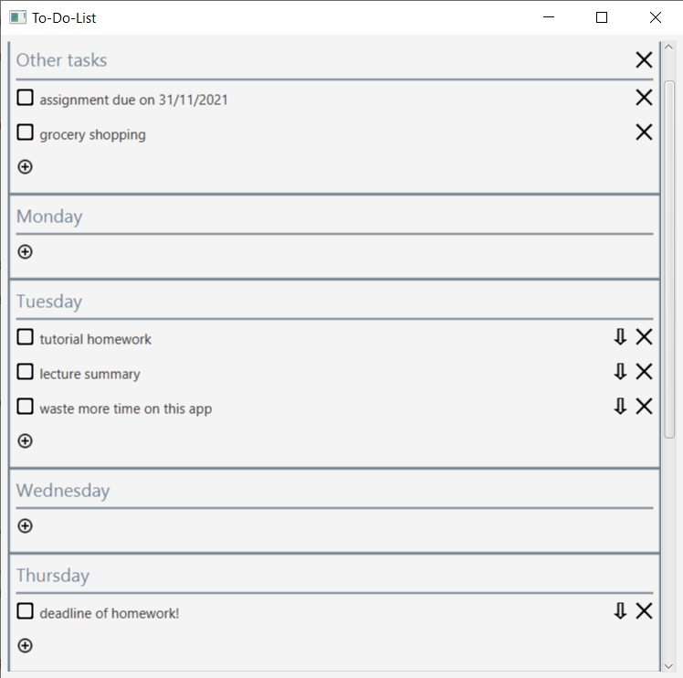

# To-Do-List

---
A simple and intuitive desktop application using Java 11 and JavaFX to keep track of daily tasks.

It requires JDK 11 to run. 

This is a hobby project. As such, feature implementation is designed for 
my own convenience. 
